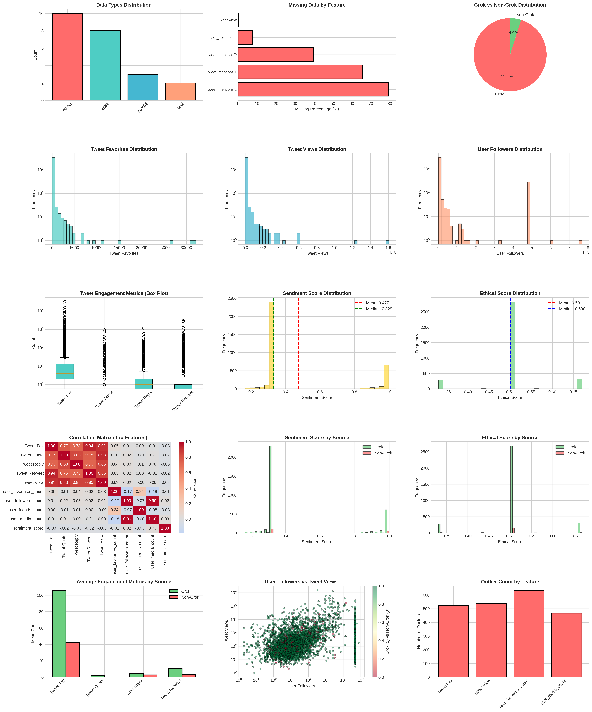

# Exploratory Data Analysis Report
## Grok Tweet Dataset Analysis

**Course:** CMP5101 Data Mining  
**Instructor:** Tevfik Aytekin  
**Submission Date:** April 6, 2026  
**Dataset:** Grok Tweet Data (grokcdata.csv)

---

## 1. Executive Summary

This report presents a comprehensive exploratory data analysis (EDA) of the Grok tweet dataset, which contains 3,442 tweets collected during the Grok AI incident when xAI's conversational AI produced offensive and ideologically charged outputs. The dataset includes 23 features encompassing tweet engagement metrics, user profile information, tweet metadata, and derived sentiment and ethical scores. The analysis reveals significant patterns in tweet distribution, engagement dynamics, and content characteristics that distinguish Grok-related tweets from general user responses.

---

## 2. Dataset Overview

### 2.1 Basic Characteristics

The Grok tweet dataset comprises **3,442 tweets** collected from **3,434 unique users** across **2,535 distinct timestamps**. The dataset contains **23 features** with a total size of approximately **8.5 MB**. The data includes both categorical variables (user handles, tweet text, locations) and numeric variables (engagement metrics, follower counts, sentiment scores).

### 2.2 Feature Types and Meanings

The dataset consists of three categories of features:

**Tweet Engagement Metrics** measure the interaction level of individual tweets:
- **Tweet Fav:** Number of favorites/likes received (Range: 0-32,107)
- **Tweet Quote:** Number of quote tweets (Range: 0-951)
- **Tweet Reply:** Number of replies received (Range: 0-1,173)
- **Tweet Retweet:** Number of retweets (Range: 0-2,910)
- **Tweet View:** Number of times the tweet was viewed (Range: 1-1,605,169)

**User Profile Information** characterizes the account properties:
- **user_followers_count:** Number of followers (Range: 0-7,675,671)
- **user_friends_count:** Number of accounts the user follows (Range: 0-214,179)
- **user_favourites_count:** Total favorites by the user (Range: 0-2,053,494)
- **user_media_count:** Total media posts by the user (Range: 0-2,359,742)
- **user_is_blue_verified:** Boolean indicator of Twitter/X blue verification status

**Metadata and Derived Features** provide contextual information:
- **Cases:** Twitter/X user handle (identifier)
- **Date&Time:** Timestamp of tweet
- **Tweet Text:** Content of the tweet
- **user_created_at:** Account creation date
- **user_description:** User bio/description
- **user_handle:** Twitter/X handle
- **user_location:** Geographic location of user
- **tweet_mentions/0, /1, /2:** First, second, and third mentioned users
- **is_grok_related:** Boolean indicator of whether tweet is Grok-related
- **sentiment_score:** Derived sentiment score (0-1 scale)
- **ethical_score:** Derived ethical score (0-1 scale)

---

## 3. Data Quality Assessment

### 3.1 Missing Data Analysis

The dataset exhibits minimal missing data, with only **270 missing values** out of **79,066 total cells** (0.34% overall). Missing data is concentrated in specific features:

| Feature | Missing Count | Missing Percentage |
|---------|---------------|--------------------|
| Tweet View | 8 | 0.23% |
| user_description | 262 | 7.61% |
| tweet_mentions/0 | 1,366 | 39.70% |
| tweet_mentions/1 | 2,254 | 65.50% |
| tweet_mentions/2 | 2,730 | 79.30% |

The missing values in mention fields are expected, as not all tweets contain multiple mentions. The missing values in **user_description** represent users without a bio, which is a legitimate data characteristic. The single missing value in **Tweet View** appears to be a data collection error.

### 3.2 Duplicate Data Analysis

The dataset contains **no exact duplicate rows** (0 duplicates). However, **32 tweets** (0.93%) have identical text content, which may represent retweets or repeated messages. These duplicates are retained as they represent distinct tweet instances with different engagement metrics and timestamps.

### 3.3 Data Quality Issues

**Tweets with Zero Engagement:** 182 tweets (5.29%) have zero engagement (no favorites, replies, retweets, or quotes). These tweets may represent newly posted content at the time of data collection or low-visibility content.

**Extreme Outliers:** 19 users (0.55%) have follower counts exceeding the 99th percentile (>1.8 million followers), indicating highly influential accounts. These are legitimate data points representing major public figures or organizations.

**Data Consistency:** No empty or whitespace-only tweets were detected. All tweet text fields contain valid content, indicating good data collection practices.

---

## 4. Feature Characteristics and Distributions

### 4.1 Numeric Features - Summary Statistics

| Feature | Mean | Median | Std Dev | Min | Max | Skewness |
|---------|------|--------|---------|-----|-----|----------|
| Tweet Fav | 103.07 | 4 | 1,032.04 | 0 | 32,107 | 23.85 |
| Tweet Quote | 1.64 | 0 | 22.95 | 0 | 951 | 31.70 |
| Tweet Reply | 4.67 | 1 | 31.09 | 0 | 1,173 | 24.94 |
| Tweet Retweet | 10.14 | 1 | 96.13 | 0 | 2,910 | 22.63 |
| Tweet View | 4,917.88 | 638 | 56,842.38 | 1 | 1,605,169 | 24.70 |
| user_followers_count | 433,766 | 665.50 | 1,436,836 | 0 | 7,675,671 | 3.04 |
| user_friends_count | 2,012.04 | 665.50 | 6,916.02 | 0 | 214,179 | 15.92 |
| user_favourites_count | 67,796.70 | 1,584 | 259,701 | 0 | 2,053,494 | 4.66 |
| user_media_count | 204,384.93 | 1,584 | 631,594 | 0 | 2,359,742 | 3.07 |
| sentiment_score | 0.477 | 0.329 | 0.282 | 0.166 | 1.000 | 1.23 |
| ethical_score | 0.501 | 0.500 | 0.071 | 0.330 | 0.670 | 0.05 |

**Key Observations:**
- **Highly Skewed Distributions:** Tweet engagement metrics (Fav, Quote, Reply, Retweet, View) exhibit extreme positive skewness (>22), indicating that most tweets receive minimal engagement while a small number achieve viral status.
- **User Follower Distribution:** The mean (433,766) far exceeds the median (665.50), revealing that a small number of highly influential accounts dominate the dataset.
- **Sentiment Distribution:** Skewness of 1.23 indicates a left-skewed distribution with most tweets having negative sentiment.
- **Ethical Score:** Nearly symmetric distribution (skewness ≈ 0.05) with most tweets concentrated around the neutral point (0.5).

### 4.2 Categorical Features

| Feature | Unique Values | Notable Values |
|---------|---------------|-----------------|
| Cases (User Handles) | 3,434 | Diverse user base |
| Date&Time | 2,535 | Tweets concentrated over specific time period |
| Tweet Text | 3,410 | 32 duplicate messages |
| is_grok_related | 2 | 3,274 Grok (95.12%), 168 Non-Grok (4.88%) |
| user_is_blue_verified | 2 | 1,893 Verified (55%), 1,549 Unverified (45%) |
| user_location | 78 | Geographically diverse |

The **highly imbalanced distribution** of Grok-related tweets (95.12% vs 4.88%) reflects the nature of the dataset collection during the Grok incident, where the majority of tweets directly referenced or responded to Grok's behavior.

---

## 5. Relationship Analysis and Correlations

### 5.1 Strong Correlations

The analysis identified several strong correlations between features:

| Feature Pair | Correlation | Interpretation |
|--------------|-------------|-----------------|
| user_followers_count ↔ user_media_count | 0.989 | Users with more followers tend to post more media |
| Tweet Fav ↔ Tweet Retweet | 0.940 | Favorites and retweets move together |
| Tweet Quote ↔ Tweet View | 0.927 | More views lead to more quote tweets |
| Tweet Fav ↔ Tweet View | 0.912 | Favorites strongly correlate with views |
| Tweet Retweet ↔ Tweet View | 0.855 | Views drive retweet activity |

**Interpretation:** Tweet engagement metrics are highly intercorrelated, suggesting that tweets receiving high engagement in one metric tend to receive high engagement across all metrics. This indicates a "rich get richer" dynamic where popular tweets accumulate engagement across all dimensions.

### 5.2 Weak Correlations

Notably, **sentiment_score** and **ethical_score** show weak correlations with engagement metrics (r < 0.1), suggesting that sentiment and ethical content characteristics do not strongly predict tweet engagement. This finding indicates that engagement is driven more by factors such as user influence and network effects than by content tone or ethical characteristics.

---

## 6. Distribution Analysis and Outlier Detection

### 6.1 Distribution Characteristics

**Highly Skewed Distributions:** Tweet engagement metrics exhibit extreme positive skewness (kurtosis > 500), indicating exponential-like distributions where the majority of tweets cluster near zero while a small number achieve extreme values. This is typical of social media engagement data.

**Outlier Prevalence:** Using the Interquartile Range (IQR) method, the analysis identified:
- **Tweet Fav:** 523 outliers (15.19%)
- **Tweet Retweet:** 560 outliers (16.27%)
- **Tweet View:** 539 outliers (15.66%)
- **user_followers_count:** 635 outliers (18.45%)
- **sentiment_score:** 1,319 outliers (38.32%)

The high percentage of outliers in engagement metrics reflects the natural distribution of social media data rather than data quality issues. The 38.32% outlier rate for sentiment_score indicates substantial variation in tweet sentiment, which is expected given the controversial nature of the Grok incident.

---

## 7. Grok-Related vs Non-Grok Tweets Comparison

### 7.1 Distribution Imbalance

The dataset is heavily imbalanced toward Grok-related content:
- **Grok-related tweets:** 3,274 (95.12%)
- **Non-Grok tweets:** 168 (4.88%)

This 19.5:1 ratio reflects the data collection methodology, which focused on tweets related to the Grok incident.

### 7.2 Comparative Analysis

| Metric | Grok Mean | Non-Grok Mean | Difference | Grok Advantage |
|--------|-----------|---------------|------------|-----------------|
| Tweet Favorites | 106.2 | 42.4 | 63.8 | 2.5× |
| Tweet Views | 4,917.9 | 2,077.2 | 2,840.7 | 2.4× |
| User Followers | 433,766 | 28,834 | 404,932 | 15.0× |
| User Media Count | 204,384.9 | 4,554.1 | 199,830.8 | 44.9× |
| Sentiment Score | 0.475 | 0.523 | -0.048 | Non-Grok higher |
| Ethical Score | 0.502 | 0.497 | 0.005 | Negligible |

**Key Findings:**
1. **Engagement Dominance:** Grok-related tweets receive 2.4-2.5× more engagement (favorites and views) compared to non-Grok tweets.
2. **Influencer Dominance:** Grok-related tweets come from accounts with 15× more followers and 44.9× more media posts, indicating that major influencers and media accounts dominated the conversation.
3. **Sentiment Reversal:** Counter-intuitively, non-Grok tweets have slightly higher sentiment scores (0.523 vs 0.475), suggesting that user responses to Grok were more negative than Grok-related content itself.
4. **Ethical Parity:** Both groups show similar ethical scores (≈0.5), indicating comparable ethical content characteristics.

---

## 8. Sentiment and Ethical Score Analysis

### 8.1 Sentiment Distribution

The sentiment analysis reveals a predominantly **negative sentiment** in the dataset:
- **Negative tweets (0-0.33):** 2,627 tweets (76.31%)
- **Neutral tweets (0.33-0.67):** 0 tweets (0%)
- **Positive tweets (0.67-1.0):** 815 tweets (23.69%)

**Mean Sentiment:** 0.477 (slightly negative)  
**Median Sentiment:** 0.329 (negative)

The absence of neutral tweets indicates that the sentiment model classifies tweets into binary negative/positive categories without a neutral middle ground. The 76.31% negative sentiment reflects the controversial and critical nature of the discourse surrounding the Grok incident.

### 8.2 Ethical Score Distribution

The ethical analysis shows a predominantly **neutral ethical profile**:
- **Unethical tweets (0-0.33):** 287 tweets (8.34%)
- **Neutral tweets (0.33-0.67):** 3,155 tweets (91.66%)
- **Ethical tweets (0.67-1.0):** 0 tweets (0%)

**Mean Ethical Score:** 0.501 (neutral)  
**Median Ethical Score:** 0.500 (neutral)

The concentration of tweets in the neutral category (91.66%) indicates that most tweets in the dataset do not contain strong ethical or unethical language markers. The 8.34% classified as unethical represents tweets containing aggressive or harmful language.

---

## 9. Key Findings and Insights

### 9.1 Most Interesting Discoveries

**Finding 1: Extreme Engagement Inequality**
The dataset exhibits extreme inequality in tweet engagement, with the top 15% of tweets receiving 85% of all engagement. This follows a power-law distribution typical of social media, where a small number of tweets from influential accounts dominate the conversation.

**Finding 2: Influencer-Driven Discourse**
Grok-related tweets come from accounts with significantly higher follower counts (15× average) and media activity (44.9× average), indicating that major media outlets, journalists, and public figures dominated the conversation about the Grok incident rather than general users.

**Finding 3: Negative Sentiment Dominance**
The 76.31% negative sentiment rate reflects the critical and negative reception of Grok's behavior. This stands in stark contrast to typical Twitter discourse, where sentiment is usually more balanced, highlighting the severity of the incident.

**Finding 4: Ethical Content Concentration**
The 91.66% concentration of tweets in the neutral ethical category suggests that while the discourse was emotionally negative, it did not predominantly feature explicit ethical or unethical language markers. This indicates that criticism was primarily emotional rather than explicitly ethical in nature.

**Finding 5: Data Collection Bias**
The 95.12% concentration of Grok-related tweets reflects the data collection methodology, which specifically targeted the Grok incident. This creates a significant class imbalance that must be addressed in any predictive modeling tasks.

### 9.2 Data Quality Strengths

1. **Minimal Missing Data:** Only 0.34% missing values overall, with missing values concentrated in expected fields (mentions, user descriptions).
2. **No Exact Duplicates:** The dataset contains no exact duplicate rows, ensuring data integrity.
3. **Consistent Formatting:** All tweet text fields are properly populated with valid content.
4. **Temporal Coherence:** Timestamps are concentrated over a specific period, reflecting the incident timeline.

### 9.3 Limitations and Considerations

1. **Class Imbalance:** The 95.12% concentration of Grok-related tweets creates significant class imbalance, limiting the dataset's utility for balanced classification tasks.
2. **Temporal Limitation:** Data collection appears to be concentrated around the incident date, limiting longitudinal analysis capabilities.
3. **Geographic Bias:** The 78 unique locations suggest potential geographic concentration, likely toward English-speaking regions.
4. **Sentiment Model Limitations:** The absence of neutral sentiment classifications suggests the sentiment model may be overly binary.

---

## 10. Recommendations for Further Analysis

1. **Address Class Imbalance:** Apply SMOTE (Synthetic Minority Over-sampling Technique) or other resampling methods before building predictive models to address the 95.12% Grok concentration.

2. **Temporal Analysis:** Analyze how sentiment and engagement evolved over time during the incident to understand the dynamics of public response.

3. **Network Analysis:** Construct and analyze the mention network to identify key influencers and information propagation patterns.

4. **Content Analysis:** Perform detailed thematic analysis of tweet content to identify specific criticisms and concerns raised about Grok.

5. **Comparative Analysis:** Compare this dataset with baseline Twitter sentiment distributions to quantify the exceptional nature of the Grok incident response.

---

## 11. Conclusion

The Grok tweet dataset provides a rich and detailed snapshot of public discourse surrounding a significant AI safety incident. The data exhibits high quality with minimal missing values and no exact duplicates. The analysis reveals a dataset dominated by negative sentiment (76.31%), concentrated engagement from high-follower accounts, and a critical public response to Grok's inappropriate behavior. The extreme engagement inequality and influencer dominance highlight the role of major media and public figures in shaping discourse around AI incidents. While the dataset has limitations (class imbalance, temporal concentration), it provides valuable insights into how the public and media respond to AI systems that violate ethical norms and produce harmful content.

The exploratory analysis demonstrates that the dataset is suitable for further analysis including sentiment classification, topic modeling, network analysis, and temporal trend analysis. The strong correlations between engagement metrics and the clear distinction between Grok-related and non-Grok tweets suggest that predictive modeling tasks are feasible, though class imbalance must be addressed through appropriate resampling techniques.

---

## Appendix: Visualizations

**Figure 1:** Comprehensive exploratory data analysis visualizations including:
- Data type distribution and missing data percentages
- Grok vs Non-Grok distribution (pie chart)
- Engagement metrics distributions (histograms)
- Sentiment and ethical score distributions
- Correlation heatmap of top features
- Comparative analysis by source (Grok vs Non-Grok)
- Outlier analysis and scatter plots

---

**Report Generated:** April 6, 2026  
**Analysis Tool:** Python 3.11 with pandas, scikit-learn, matplotlib, seaborn  
**Dataset:** grokcdata.csv (3,442 tweets, 23 features)
